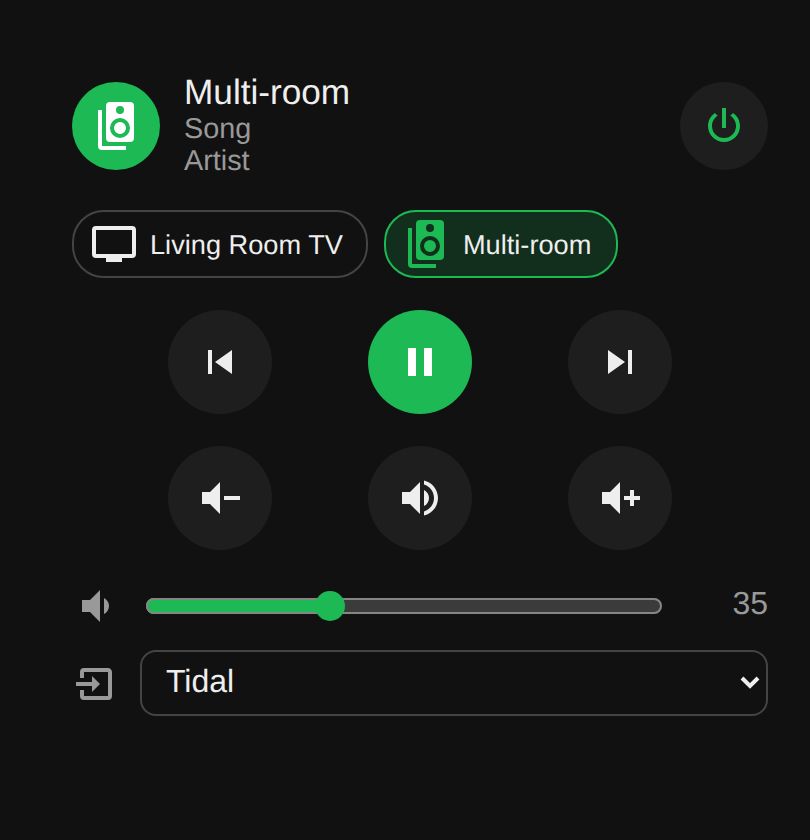
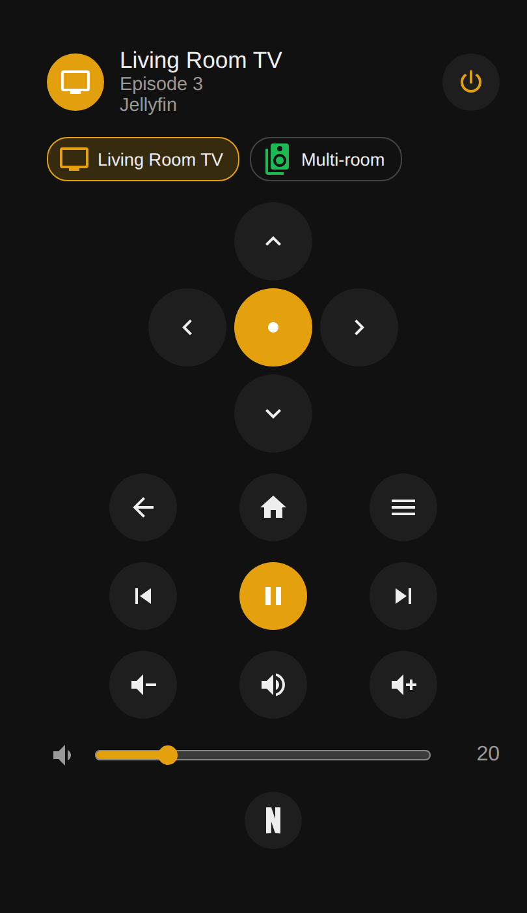

# Omni Remote

[](https://my.home-assistant.io/redirect/hacs_repository/?owner=PeterSlijkhuis&repository=Omni-Remote&category=plugin)

[](https://hacs.xyz/docs/faq/custom_repositories)
[](https://github.com/PeterSlijkhuis/Omni-Remote/actions/workflows/validate.yml)
[](https://github.com/PeterSlijkhuis/Omni-Remote/actions/workflows/ci.yml)

A Home Assistant dashboard card: one universal remote that follows whatever is playing.

Put all your media players in one card. When the living room TV is streaming, the d-pad, volume and play/pause buttons control the TV and the card takes on the TV's icon and color. Turn the TV off and start music on the multi-room speakers, and the same buttons now control the speakers.

| Speakers playing | TV playing |
| --- | --- |
|  |  |

## Features

- **Follows the action.** Picks the device that is playing, then paused, then on, in the order you list them.
- **Works with any media player.** Speakers, TVs, streamers, receivers, Kodi, Plex, Jellyfin, Sonos, Chromecast and anything else that shows up as a `media_player`.
- **D-pad for TVs and streamers.** Built-in key maps for Apple TV, Android TV / Google TV / Nvidia Shield, Fire TV (ADB), Roku, LG webOS, Samsung, Sony Bravia, Philips and Kodi. The integration and its remote are detected automatically.
- **Only useful buttons.** Buttons a player does not support are hidden.
- **Volume slider, source picker and hold-to-repeat.**
- **Send volume elsewhere,** for example to a soundbar or AV receiver.
- **Custom buttons and actions** for app shortcuts, scripts or IR hubs.
- **Lock to one device** by tapping its chip; tap again to go back to automatic.
- **Visual editor,** so no YAML is needed for the basics.

## Before you start

You need:

- Home Assistant 2024.1 or newer.
- [HACS](https://hacs.xyz/docs/use/) installed. If the sidebar has no **HACS** entry yet, follow the HACS download guide first.
- Your media devices already added to Home Assistant through their integration (for example Apple TV, Android TV Remote, Sonos, Cast, LG webOS). The card controls what Home Assistant already knows about; it does not add devices itself.

## Step 1: Add the card to HACS

**One click:** press the **Open your Home Assistant instance** button at the top of this page, confirm your Home Assistant address, and click **Add**. Then go to step 2.

**Or by hand:**

1. In Home Assistant, open **HACS** from the sidebar.
2. Click the three dots in the top right corner and choose **Custom repositories**.
3. Paste `https://github.com/PeterSlijkhuis/Omni-Remote` in **Repository**.
4. Choose **Dashboard** as the **Type** and click **Add**, then close the dialog.

## Step 2: Download it

1. In HACS, search for **Omni Remote Card** and open it.
2. Click **Download** (bottom right), keep the latest version and click **Download** again.
3. Reload your browser (Ctrl+F5, or Cmd+Shift+R on a Mac). On the phone app, pull down to refresh, or use Settings, Companion app, Debugging, **Reset frontend cache**.

HACS registers the card as a dashboard resource for you. You do not need to edit any files or restart Home Assistant.

## Step 3: Add the card to a dashboard

1. Open the dashboard where you want the remote.
2. Click the pencil (**Edit dashboard**) in the top right corner.
3. Click **Add card**, type `Omni Remote` in the search box and pick **Omni Remote**.
4. The card starts with a few of your media players already filled in. Adjust them in the editor (step 4) and click **Save**.

## Step 4: Set up your devices

The editor shows one box per media player. The order matters: **the first device in the list that is playing gets the remote.** Put the device you use most at the top.

For each device:

1. **Media player:** pick the player from the dropdown. Only media players are listed.
2. **Name, Icon, Accent color:** optional. The card changes to this icon and color when the device is active. Colors are written like `#1db954`.
3. **Remote type:** leave on **Detect automatically**. Change it only if the d-pad sends the wrong keys.
4. **Remote entity (d-pad):** leave empty to use the remote that belongs to the same device. Pick one yourself if your TV has a separate remote entity, for example from a Harmony or Broadlink hub.
5. **Send volume to:** optional. Pick your soundbar or receiver if volume should go there instead of to the player.

Use the arrows to change the order, the bin to remove a device, and **Add a media player** at the bottom to add another.

Under **Card options** you can switch the device chips, artwork background, volume slider and source picker on or off.

### Where to find your entities

If you are not sure which entity is which:

- **Settings, Devices & services, Entities:** type `media_player.` or `remote.` in the search box. The entity id is shown for each row.
- **Settings, Devices & services, Devices:** open your TV or speaker. Its media player and remote are listed together on the device page.
- **Developer tools, States:** filter on `media_player.` to see every player with its current state. Start something playing and check which one says `playing`.

Tips:

- One TV often has several media players (for example a Cast player and a TV player). Try each and keep the one that behaves best, or list both.
- Speaker groups (Sonos, Music Assistant, Cast groups) work as one entry.
- If an entity id is wrong, the card shows a warning naming it.

## Step 5: Use it

- **The card follows what is playing.** Start something on any listed device and the buttons, icon and color switch to it.
- **Tap a chip** under the header to lock the remote to that device, for example to turn on a TV that is off. A lock icon shows it is locked. Tap the chip again to go back to automatic.
- **Hold** a volume or arrow button to repeat it.
- **Tap the icon or name** to open the full Home Assistant controls for that device.
- **Power** turns the active device on or off.

### How it picks a device

The card walks your list in order and picks:

1. The first device that is **playing** (or buffering).
2. Otherwise the first device that is **paused**.
3. Otherwise the first device that is **on** or **idle**.
4. Otherwise the first device in the list, so the power button can turn it on.

## Manual installation (without HACS)

1. Download `omni-remote-card.js` from the [latest release](https://github.com/PeterSlijkhuis/Omni-Remote/releases/latest) (or `dist/omni-remote-card.js` from this repository).
2. Copy it into your Home Assistant `config/www/` folder, for example with the File editor or Samba add-on.
3. Go to Settings, Dashboards, three dots in the top right, **Resources**. If you do not see Resources, turn on **Advanced mode** in your user profile first.
4. Click **Add resource**, enter `/local/omni-remote-card.js`, choose **JavaScript module** and click **Create**.
5. Reload your browser and continue with step 3.

## YAML configuration

Everything the visual editor does can also be written in YAML (open the card, then **Show code editor**). YAML also unlocks custom buttons, action overrides and hiding buttons.

### Short form

```yaml
type: custom:omni-remote-card
entities:
  - media_player.living_room_tv
  - media_player.kitchen_speakers
```

### Full example

```yaml
type: custom:omni-remote-card
entities:
  - entity: media_player.living_room_apple_tv
    name: Living Room TV
    icon: mdi:television
    color: "#e5a00d"
    volume_entity: media_player.soundbar      # volume and mute go to the soundbar
    buttons:
      - icon: mdi:netflix
        name: Netflix
        perform_action: media_player.select_source
        data:
          entity_id: media_player.living_room_apple_tv
          source: Netflix

  - entity: media_player.kitchen_speakers
    name: Kitchen
    icon: mdi:speaker-multiple
    color: "#1db954"

  - entity: media_player.bedroom_lg_tv
    name: Bedroom
    icon: mdi:television-classic
    color: "#a50034"
    platform: lg_webos                        # usually detected automatically
    hide: [previous, next]
```

### Card options

| Option | Default | Description |
| --- | --- | --- |
| `entities` | required | Media players in priority order. Each item is an entity id or an object (below). |
| `color` | theme primary color | Accent color used when a device has no `color` of its own. |
| `show_chips` | `true` | Show the device chips used to lock the remote to one device. |
| `show_artwork` | `true` | Show a blurred copy of the current artwork behind the card. |
| `show_volume_slider` | `true` | Show a volume slider when the player supports setting the volume. |
| `show_source` | `true` | Show a source picker when the player has a source list. |
| `buttons` | none | Custom buttons shown for every device (same format as below). |

### Device options

| Option | Default | Description |
| --- | --- | --- |
| `entity` | required | The `media_player` entity. |
| `name` | friendly name | Name shown on the card. |
| `icon` | entity icon | Icon shown when this device is active. |
| `color` | card `color` | Accent color when this device is active. |
| `platform` | `auto` | Which d-pad key map to use. See the table below. |
| `remote` | auto | A `remote` entity. When empty, the remote on the same device is used. |
| `volume_entity` | `entity` | Send volume and mute to another player, such as a soundbar or AV receiver. |
| `hide` | none | Buttons to hide, for example `[previous, next, menu]`. |
| `commands` | preset | Override d-pad key names, for example `{ menu: "INFO" }`. |
| `actions` | none | Replace what a button does. Keys are button names, values are actions (below). |
| `buttons` | none | Extra buttons for this device, each with `icon` and/or `name` plus an action. |

Button names: `power`, `previous`, `play_pause`, `next`, `volume_down`, `mute`, `volume_up`, `up`, `down`, `left`, `right`, `select`, `back`, `home`, `menu`.

### Platforms

With `platform: auto` the card reads which integration the media player belongs to and picks the matching key map. Set it yourself when detection does not work, for example for a TV controlled through a Broadlink or Harmony hub.

| `platform` | Integration | D-pad is sent with |
| --- | --- | --- |
| `apple_tv` | Apple TV | `remote.send_command` |
| `android_tv` | Android TV Remote (Google TV, Shield, Chromecast with Google TV) | `remote.send_command` |
| `android_adb` | Android Debug Bridge (Fire TV, Android TV over ADB) | `androidtv.adb_command` |
| `roku` | Roku | `remote.send_command` |
| `lg_webos` | LG webOS TV | `webostv.button` |
| `samsung_tv` | Samsung Smart TV | `remote.send_command` |
| `sony_bravia` | Sony Bravia TV | `remote.send_command` |
| `philips_tv` | Philips TV | `remote.send_command` |
| `kodi` | Kodi | `kodi.call_method` |
| `generic` | Anything else with a `remote` entity | `remote.send_command` with `up`, `down`, `left`, `right`, `select`, `back`, `home`, `menu` |

Players without a remote (speakers, Cast, Sonos and so on) simply show no d-pad.

### Actions

An action is any Home Assistant action (service) with optional `data` and `target`:

```yaml
actions:
  volume_up:
    perform_action: script.receiver_volume_up
  home:
    perform_action: remote.send_command
    target:
      entity_id: remote.harmony_hub
    data:
      device: Living Room TV
      command: Home
```

`service:` is accepted as an alias for `perform_action:`.

## Buttons and what they call

| Button | Action |
| --- | --- |
| Power | `media_player.turn_on` / `turn_off`, or `remote.turn_on` / `turn_off` when the player cannot power itself |
| Previous, play/pause, next | `media_player.media_previous_track`, `media_play_pause`, `media_next_track` |
| Volume down, mute, volume up, slider | `media_player.volume_down`, `volume_mute`, `volume_up`, `volume_set` on `volume_entity` |
| Source | `media_player.select_source` |
| D-pad, Back, Home, Menu | Depends on `platform`, see above |

Tapping the icon or name opens the more-info dialog of the active device.

## Troubleshooting

| Problem | Fix |
| --- | --- |
| *Custom element doesn't exist: omni-remote-card* | The browser still has the old page. Reload with cache cleared (Ctrl+F5 or Cmd+Shift+R), or on the mobile app go to Settings, Companion app, Debugging, **Reset frontend cache**. Also check the resource exists under Settings, Dashboards, three-dot menu, **Resources**. |
| **Omni Remote** is not in the card list | Same as above: reload the browser after installing. |
| The card says *Not found: media_player.xxx* | The entity id is wrong. Look it up as described in step 4. |
| No d-pad appears | The player has no remote entity and no known platform. Set `remote:` and `platform:` on that device (see Platforms). |
| A button does nothing | Open Settings, System, Logs to see the error. For TVs try another `platform`, or override that button under `actions`. |
| The wrong device gets the buttons | Put the device you care about most first in the list, or tap its chip to lock the remote to it. |

## Updating

HACS shows an update on the HACS page and under Settings, Updates when a new version is released. Click **Update**, then reload your browser.

## Development

```sh
npm install
npm test        # routing logic tests
npm run build   # writes dist/omni-remote-card.js
```

The source lives in `src/`. `dist/omni-remote-card.js` is the bundled file Home Assistant loads; the CI workflow fails if it is out of date, so rebuild and commit it after changing `src/`.

To publish a version, create a GitHub release with a tag such as `v1.1.0`. The release workflow builds the card and attaches `omni-remote-card.js`, which HACS then offers as an update.
